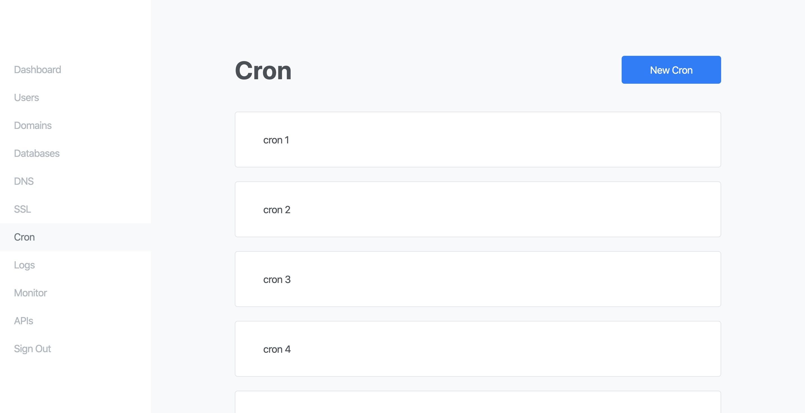

# jaydon

Nginx Control Panel

> This is an experimental control panel written for a niche reason. Use at your own risk.

## Quick Installation

If you're using Ubuntu you can run this command to install everything in **Before Installation** and **Installation** sections.

> This would install Jaydon to the path you're currently on.

```
curl -L https://raw.githubusercontent.com/ozgrozer/jaydon/master/install.sh | bash
```

## Before Installation

> Unlike other control panels with Jaydon you control the versions of your softwares such as Nginx, Node.js etc.

Before you install Jaydon you need:

- [Nginx](https://www.nginx.com/resources/wiki/start/topics/tutorials/install/)
- [Git](https://git-scm.com/book/en/v2/Getting-Started-Installing-Git)
- [Node.js](https://nodejs.org/en/download/package-manager/)
- [NPM](https://www.npmjs.com/get-npm)
- [Yarn](https://www.npmjs.com/package/yarn)
- [PM2](https://www.npmjs.com/package/pm2)

If you're using Ubuntu you can use these commands to simply install dependencies.

```
# Update package list
sudo apt update -y

# Install Nginx
sudo apt install nginx -y

# Install Git
sudo apt install git -y

# Install Node.js
curl -sL https://deb.nodesource.com/setup_12.x | sudo -E bash -
sudo apt install nodejs -y

# Install Yarn
sudo npm i -g yarn

# Install PM2
sudo npm i -g pm2
```

## Installation

If you have all the dependencies above now you can install Jaydon.

```
# Download repository
git clone https://github.com/ozgrozer/jaydon.git && cd jaydon

# Install dependencies
yarn install

# Create necessary database tables
yarn run firstRun

# Start server with PM2
pm2 start ./src/backend/server.js --name jaydon -i max
pm2 startup
pm2 save

# Open your browser and go to
http://your-ip:1148
```

## Preview



## Todo

- [ ] Domains
- [ ] Users
- [ ] DNS
- [ ] SSL
- [ ] Cron
- [ ] Logs
- [ ] Monitor
- [ ] API

## License

[MIT](license)
