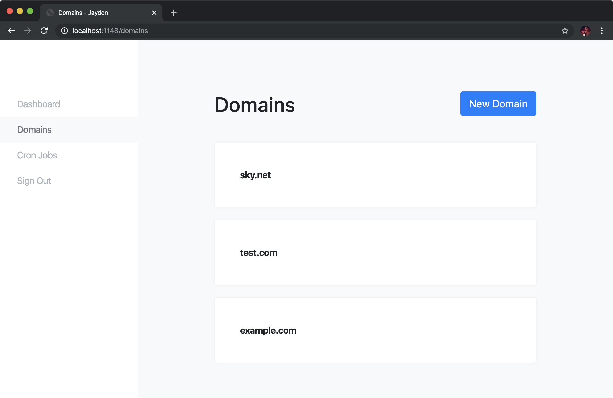
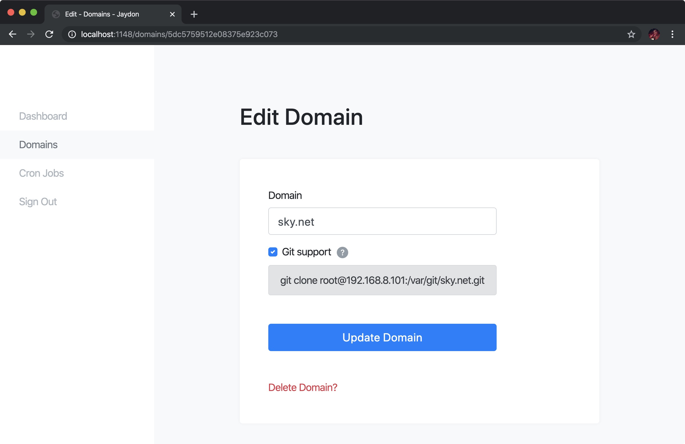

# jaydon

[](https://github.com/ozgrozer/jaydon/tags)
[](https://github.com/ozgrozer/jaydon/blob/master/license)
[](https://app.releasly.co/sites/ozgrozer/jaydon)

Nginx Control Panel

> This is an experimental control panel written for a niche reason. Use at your own risk.

## Quick Installation

If you're using Ubuntu 18 you can run this command to install everything in **Before Installation** and **Installation** sections.

```
curl -L https://raw.githubusercontent.com/ozgrozer/jaydon/master/install.sh | bash
```

## Before Installation

> Unlike other control panels with Jaydon you control the versions of your softwares such as Nginx, Node.js etc.

Before you install Jaydon you need:

- [MongoDB](https://docs.mongodb.com/manual/tutorial/install-mongodb-on-ubuntu/)
- [Certbot](https://certbot.eff.org/lets-encrypt/ubuntubionic-nginx)
- [Nginx](https://www.nginx.com/resources/wiki/start/topics/tutorials/install/)
- [Git](https://git-scm.com/book/en/v2/Getting-Started-Installing-Git)
- [Node.js](https://nodejs.org/en/download/package-manager/) & [NPM](https://www.npmjs.com/get-npm)
- [Yarn](https://www.npmjs.com/package/yarn)
- [PM2](https://www.npmjs.com/package/pm2)

If you're using Ubuntu 18 you can use these commands to simply install dependencies.

```
# Install MongoDB
sudo apt install gnupg -y
wget -qO - https://www.mongodb.org/static/pgp/server-4.2.asc | sudo apt-key add -
echo "deb [ arch=amd64 ] https://repo.mongodb.org/apt/ubuntu bionic/mongodb-org/4.2 multiverse" | sudo tee /etc/apt/sources.list.d/mongodb-org-4.2.list
sudo apt update -y
sudo apt install mongodb-org -y
sudo service mongod start
systemctl enable mongod.service

# Install Certbot
sudo apt install software-properties-common -y
sudo add-apt-repository universe -y
sudo add-apt-repository ppa:certbot/certbot -y
sudo apt update -y
sudo apt install certbot python-certbot-nginx -y

# Install Nginx
sudo apt install nginx -y

# Install Git
sudo apt install git -y

# Install Node.js
curl -sL https://deb.nodesource.com/setup_10.x | sudo -E bash -
sudo apt install nodejs -y

# Install Yarn
sudo npm i -g yarn

# Install PM2
sudo npm i -g pm2
```

## Installation

If you have all the dependencies above now you can install Jaydon.

```
# Clone Git repository
git clone https://github.com/ozgrozer/jaydon.git && cd jaydon

# Install dependencies
yarn install

# Build React app
yarn build

# Create necessary database tables
yarn run firstRun

# Start server with PM2
pm2 start ./src/backend/server.js --name jaydon -i max
pm2 startup
pm2 save

# Open your browser and go to
http://your-ip:1148
```

## Update

Make sure update.sh is executable.

```
chmod +x update.sh
```

And just run it.

```
./update.sh
```

## API

Jaydon API built on [REST](https://en.wikipedia.org/wiki/Representational_state_transfer). It accepts requests as JSON and returns responses as JSON too.

Base URL.

```
http://your-ip:1148/api/v1
```

Example POST request.

```json
{
  "meta": {
    "apiKey": "YOUR_API_KEY",
    "category": "domain|cronJob",
    "event": "create|read|update|delete"
  },
  "data": {
  }
}
```

"data" object.

```json
// create domain
"data": {
  "domain": "example.com",
  "gitSupport": true,
  "sslSupport": true
}

// read a domain
"data": {
  "id": "domain id"
}
// read domains
"data": {
}

// update domain
"data": {
  "id": "domain id",
  "domain": "example.com",
  "gitSupport": false,
  "sslSupport": false
}

// delete domain
"data": {
  "id": "domain id"
}

---

// create cron job
"data": {
  "command": "node script.js",
  "schedule": "* * * * *"
}

// read a cron job
"data": {
  "id": "cron job id"
}
// read cron jobs
"data": {
}

// update cron job
"data": {
  "id": "cron job id",
  "command": "node script.js",
  "schedule": "* * * * *"
}

// delete cron job
"data": {
  "id": "cron job id"
}
```

Example 1: Create a domain with cURL.

```bash
curl http://your-ip:1148/api/v1 \
-X POST \
-H "Content-Type: application/json" \
--data-binary @- << EOF
{
  "meta": { "apiKey": "YOUR_API_KEY", "category": "domain", "event": "create" },
  "data": { "domain": "test.com", "gitSupport": false }
}
EOF
# {"success":true}
# {"success":false,"error":"error"}
```

Example 2: Update a cron job with Axios.

```js
const axios = require('axios')

const postUrl = 'http://your-ip:1148/api/v1'
const postData = {
  meta: { apiKey: 'YOUR_API_KEY', category: 'cronJob', event: 'update' },
  data: { id: 'CRON_JOB_ID', command: '/usr/bin/node ~/script.js', schedule: '0 * * * *' }
}
axios
  .post(postUrl, postData)
  .then(res => {
    console.log(res.data)
    // {"success":true}
    // {"success":false,"error":"error"}
  })
  .catch(err => {
    console.log(err)
  })
```

## Preview




## Todo

- [ ] Domains
- [ ] SSL
- [ ] DNS
- [ ] Cron
- [ ] Logs
- [ ] Monitor
- [ ] API

## Contribution

Feel free to contribute. Open a new [issue](https://github.com/ozgrozer/jaydon/issues), or make a [pull request](https://github.com/ozgrozer/jaydon/pulls).

## License

[MIT](license)
